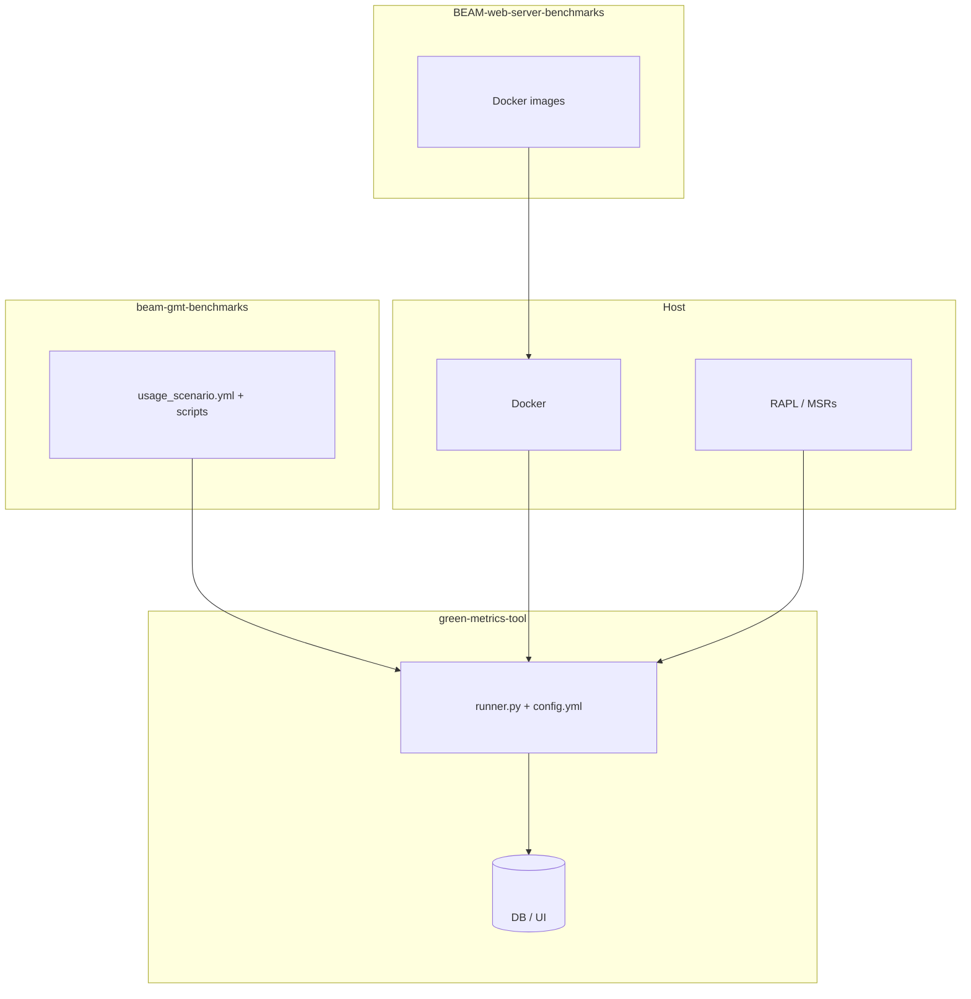

# Three-repository flow (BEAM → GMT)

How **beam-gmt-benchmarks** sits between the **host**, **Green Metrics Tool**, and [BEAM-web-server-benchmarks](https://github.com/joegharbi/BEAM-web-server-benchmarks). Entry point and reproduction steps: [README.md](../README.md). Use this page for diagrams; operational detail is in `docs/*.md`.

## Flow

The diagram uses a **top-to-bottom** layout so each repository and the host sit on **separate rows**—easier to read than four columns, where Mermaid often draws **overlapping** subgraph frames and edge bundles.

**Edges (what moves where):** images run under **Docker**; this repo is passed to **runner** (`--uri`); **runner** reads **config** and writes **DB**. **RAPL/MSRs** are optional host sensors used when those providers are enabled.

## Reading the diagram

| Box | Role |
|-----|------|
| **Host** | Runs Docker; optional **RAPL** (MSRs) for package energy — needs `msr` / setuid helpers for full GMT providers (see [ENERGY_METRICS.md](ENERGY_METRICS.md)). |
| **green-metrics-tool** | **`runner.py`** loads **`config.yml`**, runs the scenario, ingests metrics into the **DB** for **stats / UI**. |
| **BEAM-web-server-benchmarks** | Source of **Docker images** (e.g. `st-erlang-index-27`); build with `make build` or `docker build`. |
| **beam-gmt-benchmarks** | **`usage_scenario.yml`** defines containers; **`scripts/`** orchestrates invocations (e.g. [HTTP_SWEEP.md](HTTP_SWEEP.md)). |

Suggested order: **host + GMT** → **build images** → run scripts from **this repo** (they `cd` here so `git` and `--uri` match GMT’s expectations). Folder layout without manual `export`: [PATHS_AND_ENV.md](PATHS_AND_ENV.md).

## Paths by goal

| Goal | Where to start |
|------|----------------|
| Smoke test (one run) | [HTTP_SWEEP.md](HTTP_SWEEP.md) (`-c … -l 100`) |
| Production-style local runs | [LOCAL_PRODUCTION.md](LOCAL_PRODUCTION.md) |
| RAPL / energy metrics | [ENERGY_METRICS.md](ENERGY_METRICS.md) |
| Hosted cluster | [CLUSTER_AND_GITHUB.md](CLUSTER_AND_GITHUB.md) |

## Rendering the diagram

- **GitHub**: native Mermaid in Markdown (this file). `flowchart TB` plus larger `rankSpacing` / `padding` in `%%{init: …}%%` keeps subgraph **titles and boxes** from sitting on top of each other.
- **VS Code / Cursor**: Markdown preview with Mermaid support, or paste the diagram into [mermaid.live](https://mermaid.live) for PNG/SVG export.
